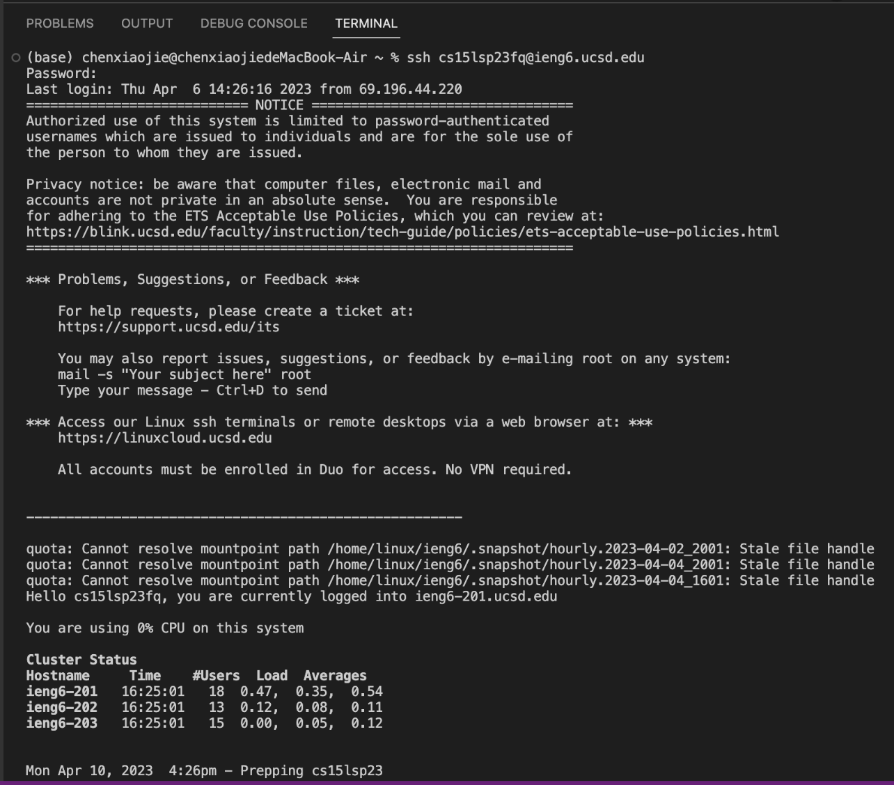

# Lab Report 1
* Download visual studio code at  https://code.visualstudio.com/

* Open a window in VScode like this:  

  

* Open your terminal inside VScode using the Terminal → New Terminal menu option

* Type the following command to the terminal:
    ```
    ssh cs15lsp23fq@ieng6.ucsd.edu
    ```

* Enter your password and if the connection is successful, the terminal should look like this:

  

* Try some commands on the remote computer using the terminal in the vscode 
  * cd ~
    * changes the current directory to the home directory of the current user. 
  * cd
    * changes the current directory to the home directory of the current user (same as cd ~)
  * ls -lat
    * lists all files in the current directory, including hidden files, sorted by modification time in reverse order and with details showing permissions and ownership
  * ls -a
    * lists all files in the current directory in short format, including hidden files
  * ls <directory> where <directory> is /home/linux/ieng6/cs15lsp23/cs15lsp23abc, where the abc is one of the other group members’ username
    * lists all files in the specified directory, where <directory> is the full path to the directory. In this case, the directory is /home/linux/ieng6/cs15lsp23/cs15lsp23abc, which is the home directory of another group member
  * cp /home/linux/ieng6/cs15lsp23/public/hello.txt ~/
    * copies the file hello.txt from the directory /home/linux/ieng6/cs15lsp23/public/ to the home directory of the current user (~)
  * cat /home/linux/ieng6/cs15lsp23/public/hello.txt
    * displays the contents of the file hello.txt on the terminal

  
  
  * explanations of each commands:
    * cd ~
      * it changes the current directory to my home directory in the remote computer's file system, which is "/home/cs15lsp23fq" in this case
    * cd 
      * the same command as the previous one, so the current directory stays as where it is
    * ls -lat
      * the output is all the files and directories in the current directory
      * there are total 112 files
      * each column represents the following information about each file:
          1. file/directory permissions (e.g. rw-r--r--)
          2. number of hard links to the file/directory
          3. owner of the file/directory (cs15lsp23fq)
          4. group owner of the file/directory (ieng6_cs15lsp23)
          5. the size of the file or directory in bytes (e.g. 7 bytes)
          6. date and time of last modification (e.g. Apr 10 16:26)
          7. name of the file or directory (e.g. hello.txt)
    * ls -a
      * the output is all the files and directories in the current directory
      * where "." represents current directory, ".." represents parent directory and files and directories starting with a dot are hidden files and directories. 
    * ls /home/linux/ieng6/cs15lsp23/cs15lsp23gv
      * the output says I cannot open directory because I don't have access to my group memeber's directory
    * cp /home/linux/ieng6/cs15lsp23/public/hello.txt ~/
      * successfully copy the file hello.txt from the directory /home/linux/ieng6/cs15lsp23/public/ to my home directory 
    * cat /home/linux/ieng6/cs15lsp23/public/hello.txt
      * the output displays the contents of the file hello.txt located in the directory /home/linux/ieng6/cs15lsp23/public
      
 
  
* Try the same commands on your own computer 
  
  
  
  
* If you want to log out of the remote server in your terminal, use either
  * Ctrl-D
  * Run the command exit
