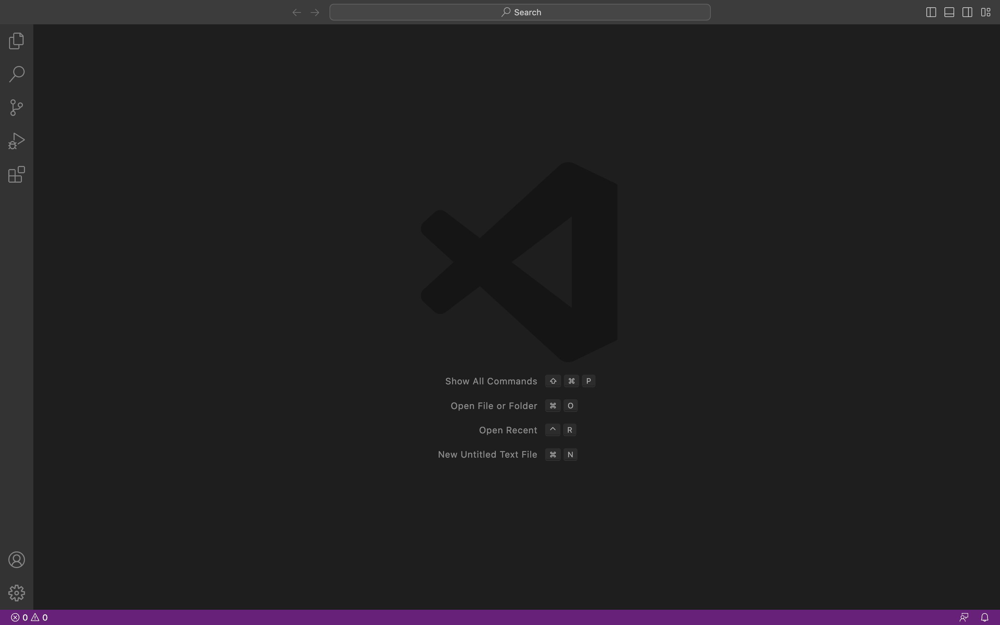
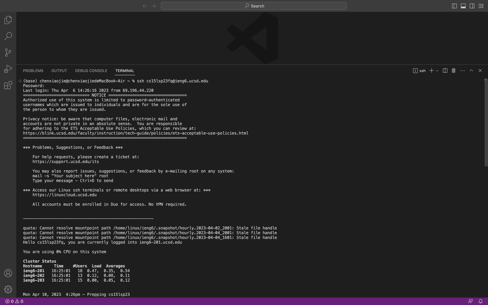
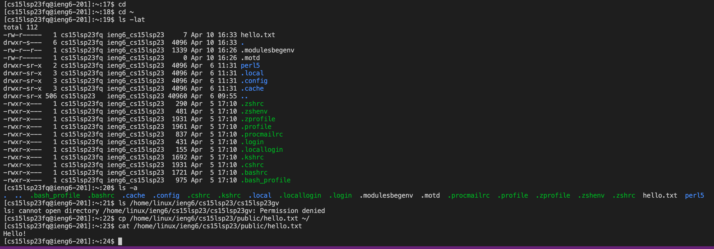
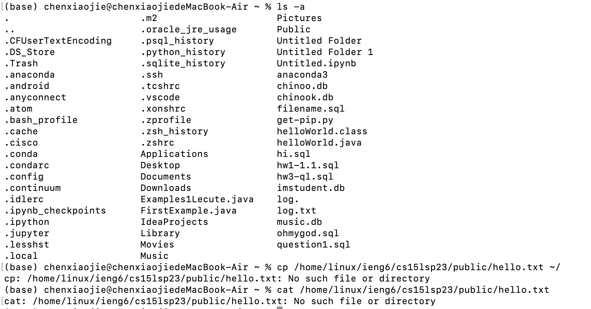
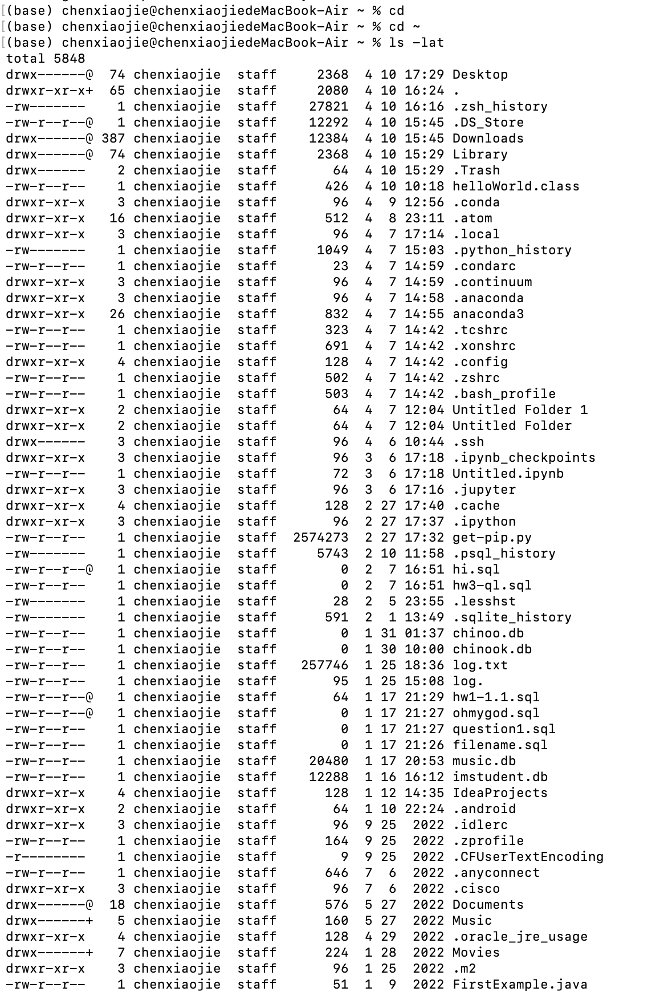

# Lab Report 1
1. Download visual studio code at  https://code.visualstudio.com/
2. Open a window in VScode like this:  

  

3. Open your terminal inside VScode using the Terminal → New Terminal menu option
4. Type ssh cs15lsp23fq@ieng6.ucsd.edu into the terminal 
5. Enter your password and if the connection is successful, the terminal should look like this:

  

6. Try some commands on the remote computer using the terminal in the vscode 
  * cd ~
  * cd
  * ls -lat
  * ls -a
  * ls <directory> where <directory> is /home/linux/ieng6/cs15lsp23/cs15lsp23abc, where the abc is one of the other group members’ username
  * cp /home/linux/ieng6/cs15lsp23/public/hello.txt ~/
  * cat /home/linux/ieng6/cs15lsp23/public/hello.txt

  
  
7. Try the same commands on your own computer 
  
  
  
  
8. If you want to log out of the remote server in your terminal, use either
  * Ctrl-D
  * Run the command exit
