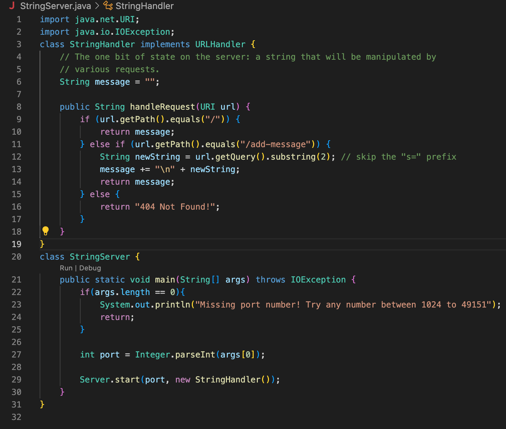
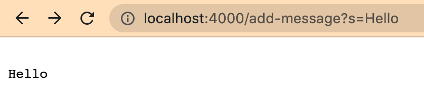

* code for StringServer: 

*screenshot of using 

```
/add-message?s=Hello
```
Which methods in your code are called?
* The <main method> of the StringServer class is called with the command-line arguments 4000
What are the relevant arguments to those methods, and the values of any relevant fields of the class?
How do the values of any relevant fields of the class change from this specific request? If no values got changed, explain why.


* 
* After the client sends an request to the URL (http://localhost:4000/add-message?s=Hello)
* The handleRequest method of the StringHandler class is called with the requested URL as input
* The if condition in the handleRequest method checks if the requested path is "/add-message", which is true in this case.
* The newString variable is set to "Hello" by extracting the value of the s query parameter from the requested URL.
* The message field is updated by concatenating a newline character and the newString value to the current value of the message field.
* The updated message field value is returned as the response body.
* As a result, the response to this request should be the updated value of the message field, which should be "Hello\n".



*screenshot of using 

```
/add-message?s=How are you
```


