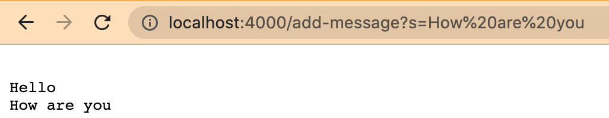

#Part 1
* code for StringServer: 

*screenshot of using 

```
/add-message?s=Hello
```
Which methods in your code are called?
* The **main method** of the StringServer class is called with the command-line arguments 4000
* After the client sends an request to the URL  http://localhost:8080/add-message?s=Hello, the handleRequest method of the StringHandler class is called with the requested URL as input

What are the relevant arguments to those methods, and the values of any relevant fields of the class?
* the URI argument: http://localhost:8080/add-message?s=Hello
* Relevant field: message field in StringHandler class
  * initial value of message field: ""
  * updated value of message field: "\nHello"
* newString value: "Hello"

How do the values of any relevant fields of the class change from this specific request? If no values got changed, explain why.
* The message field changes from empty string to "\nHello" 

*screenshot of using 

```
/add-message?s=How are you
```
Which methods in your code are called?
* The **main method** of the StringServer class is called with the command-line arguments 4000
* After the client sends an request to the URL http://localhost:4000/add-message?s=How%20are%20you, the handleRequest method of the StringHandler class is called with the requested URL as input

What are the relevant arguments to those methods, and the values of any relevant fields of the class?
* the URI argument: http://localhost:4000/add-message?s=How%20are%20you
* Relevant field: message field in StringHandler class
  * initial value of message field: "\nHello"
  * updated value of message field: "\nHello\nHow are you"
* newString value: "How are you"

How do the values of any relevant fields of the class change from this specific request? If no values got changed, explain why.
* The message field changes from "\nHello" to "\nHello\nHow are you"


#Part 2

