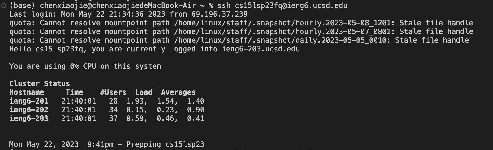
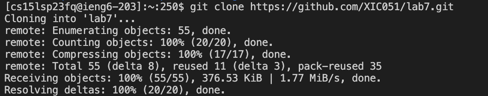
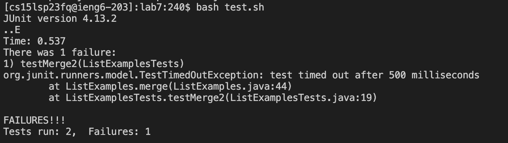
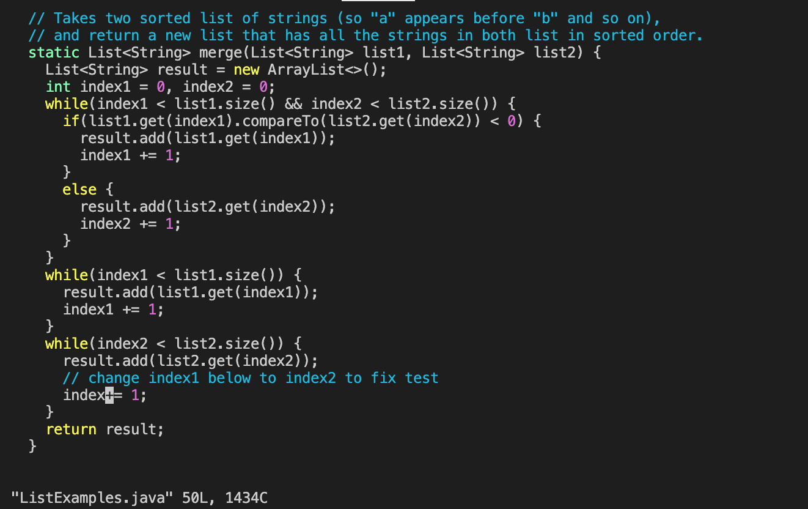
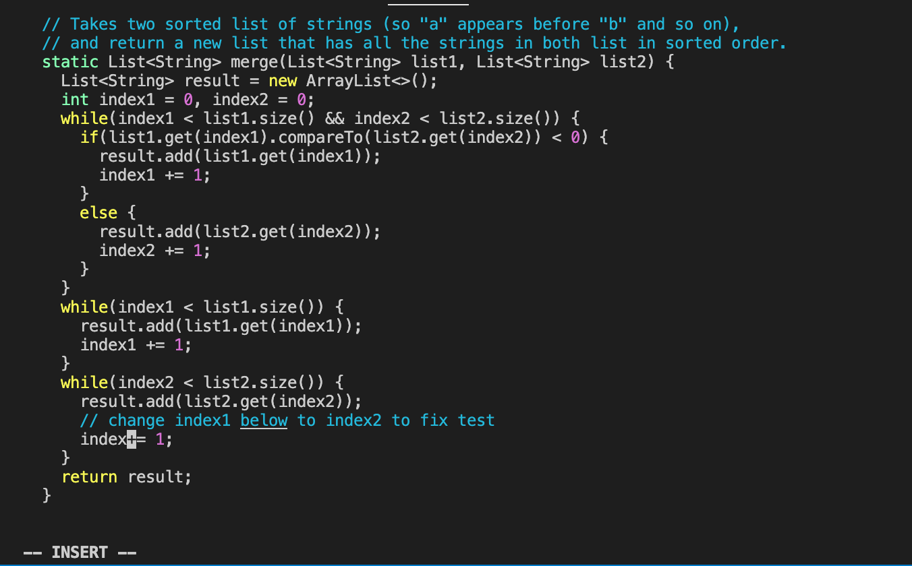
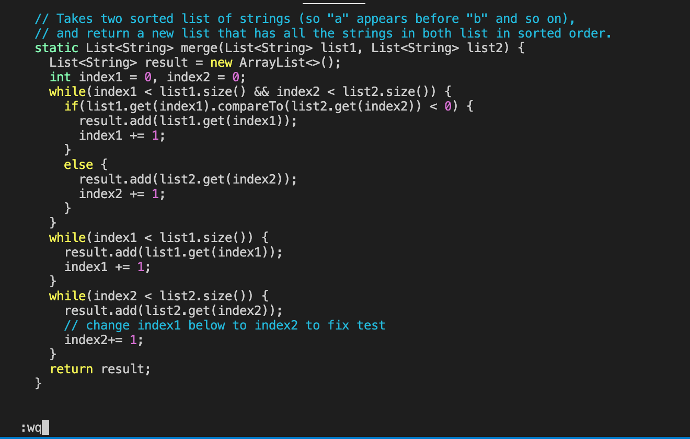
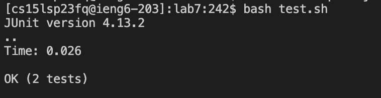
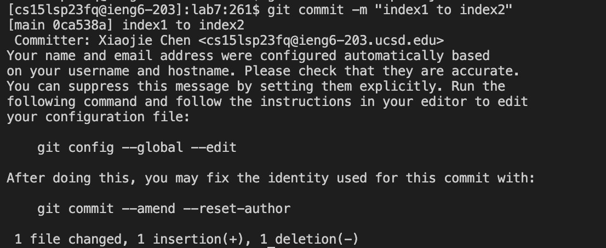
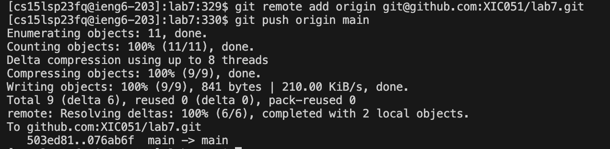

#### 1. Login to ieng6
##### Key Pressed: 
- `ssh cs15lsp23fq@ieng6.ucsd.edu<Enter>`

Explanation: 

to login to ieng6 directly

#### 2. Clone your fork of the repository from your Github account
##### Key Pressed: 
- `git clone https://github.com/ucsd-cse15l-s23/lab7.git<Enter>` 

Explanation:

to clone my fork of the repository

#### 3. Run the tests, demonstrating that they fail
##### Key Pressed: 
- `cd lab7<Enter>bash test.sh<Enter>` 

Explanation:

- `cd lab7<Enter>` to change my working directory to lab7

- `bash test.sh<Enter>` to run the test. 

#### 4. Edit the code file to fix the failing test
##### Key Pressed: 

- `vim ListExamples.javakkkkkklllllllllllxi2<esc>:wq<enter>`

Explanation: 

- `vim ListExamples.java` to enter vim. 

- **k** 6 times to move the cursor to the line of the while loop. 

- **j** 17 times so that the cursor reaches the line I need to make edits on. 

- **l** 11 times so that the cursor reaches the character "1" in "index1" exactly. 

- **x** to delete character "1".

 

- **i** to enter insertion mode. 

 

- **2** so "index1" is changed to "index2".

 

- **<esc>** to exit insertion mode. 
  
- **:**, **w**, **q**, respectively to save my changes and exit vim. 
  

  
- <enter> to exit officially

#### 5. Run the tests, demonstrating that they now succeed
##### Key Pressed: 
  
- `bash grade.sh<Enter>`
  
Explanation:
  
to run the test again. 
  
 
  
#### 6. Commit and push the resulting change to your Github account 
##### Key Pressed: 
  
- `git add ListExamples.java<Enter>git commit -m "index1 to index2"<Enter>git remote add origin git@github.com:XIC051/lab7.git<Enter>git push origin main<Enter>`

Explanation: 
- `git add ListExamples.java` 
  
This command adds the file "ListExamples.java" to the Git staging area. It prepares the file to be included in the next commit.
  
- `git commit -m "index1 to index2"` 
 
creates a new commit with commit message "index1 to index2"

- `git remote add origin git@github.com:XIC051/lab7.git`
  
adds a new remote named "origin" to my Git repository. 
  
- `git push origin main`
  
This command pushes the commits in local branch "main" to the remote repository named "origin". It uploads the changes I just made to the remote repository on GitHub.
  

  
  
  
  
  
