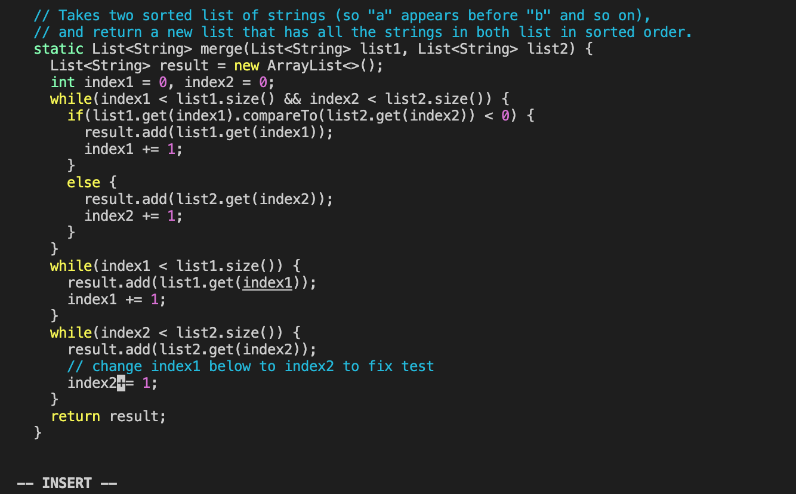

#### 1. Login to ieng6
I type in `ssh cs15lsp23fq@ieng6.ucsd.edu` and type in my password to login to ieng6. 

#### 2. Clone your fork of the repository from your Github account

#### 3. Run the tests, demonstrating that they fail
cd lab7

#### 4. Edit the code file to fix the failing test
vim ListExamples.java

##### Key Pressed: 
- I scrolled my mouse down until the cursor reaches the start of the while loop. 
- **j** 17 times so that the cursor reaches the line I need to make edits on. 
- **l** 11 times so that the cursor reaches the character "1" in "index1" exactly. 
- **x** to delete character "1".
 
- **i** to enter insertion mode. 
 
- **2** so "index1" is changed to "index2".
 
- **<esc>** to exit insertion mode. 
- **:**, **w**, **q**, respectively to save my changes and exit vim. 
 
- <enter> to exit officially

#### 5. Run the tests, demonstrating that they now succeed
  
##### Key Pressed: 
- control + R 
access command history 
- <up> <up> <enter>
`bash test.sh` is 2 up in the bash history, so I used up arrow to access it. Then I pressed enter to run this command. 
  
 
  
#### 6. Commit and push the resulting change to your Github account 
- I type `git add ListExamples.java` into my terminal.
- I type `git commit -m "index1 to index2"` into my terminal. 
  
  
  
  
  
  
  
