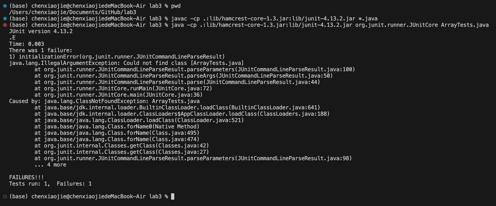

1. Post from a student
### What environment are you using (computer, operating system, web browser, terminal/editor, and so on)? 

Computer: MacBook
operating system: MacOS
Text Editor: Visual Studio Code 
terminal: Terminal (macOS)

### Detail the symptom you're seeing. Be specific; include both what you're seeing and what you expected to see instead. Screenshots are great, copy-pasted terminal output is also great. Avoid saying “it doesn't work”.

#### what I am seeing:

#### what expected to see: 

It is expected to pass all tests in ArrayTest.java 

### Detail the failure-inducing input and context. That might mean any or all of the command you're running, a test case, command-line arguments, working directory, even the last few commands you ran. Do your best to provide as much context as you can.

My input is: 

javac -cp .:lib/hamcrest-core-1.3.jar:lib/junit-4.13.2.jar *.java
java -cp .:lib/hamcrest-core-1.3.jar:lib/junit-4.13.2.jar org.junit.runner.JUnitCore ArrayTests

