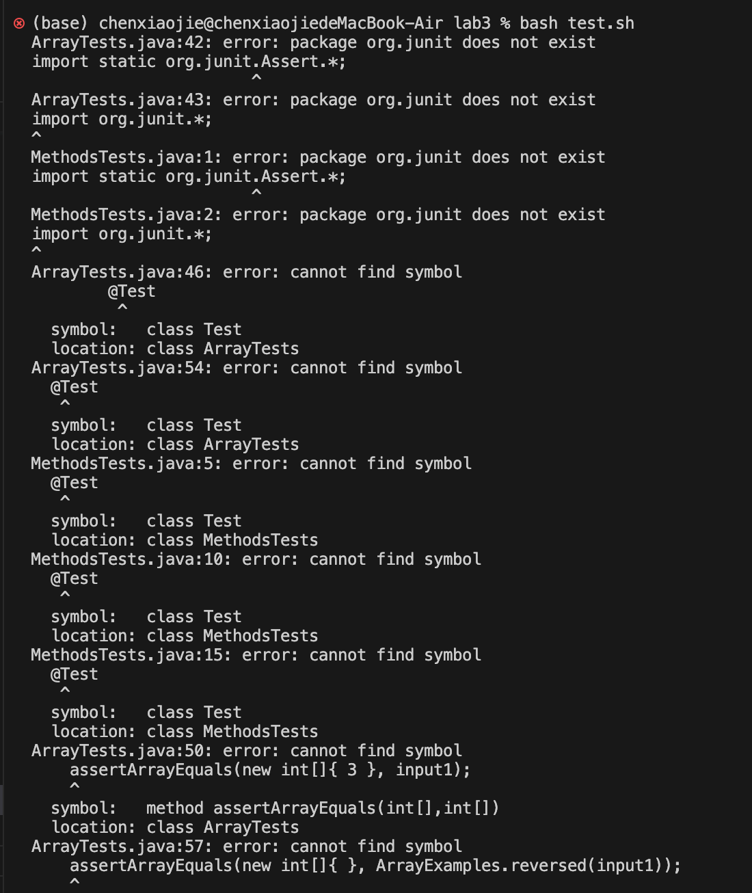
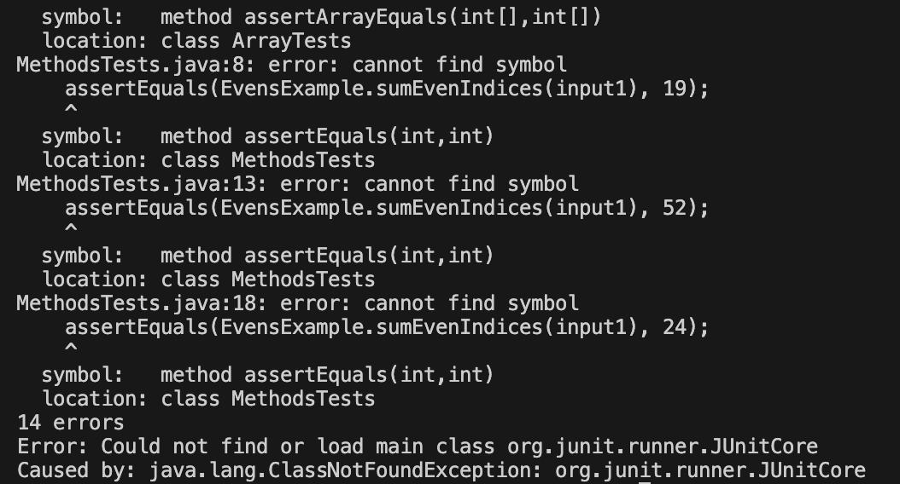
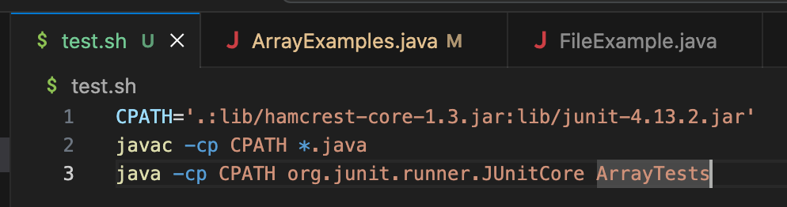
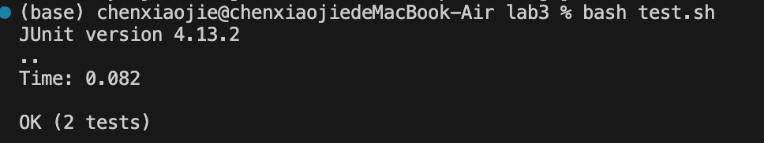
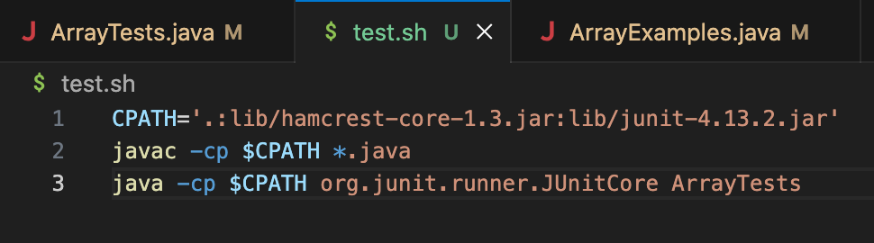

# Part 1
## 1. Post from a student
### What environment are you using (computer, operating system, web browser, terminal/editor, and so on)? 

Computer: MacBook
operating system: MacOS
Text Editor: Visual Studio Code 
terminal: Terminal (macOS)

### Detail the symptom you're seeing. Be specific; include both what you're seeing and what you expected to see instead. Screenshots are great, copy-pasted terminal output is also great. Avoid saying “it doesn't work”.

#### what I am seeing:




#### what expected to see: 

It is expected to pass all tests in ArrayTest.java. 

### Detail the failure-inducing input and context. That might mean any or all of the command you're running, a test case, command-line arguments, working directory, even the last few commands you ran. Do your best to provide as much context as you can.

Context:

I cloned the repository using https://github.com/ucsd-cse15l-w23/lab3.git and open the folder in VS code. 

My current working directory is `/Users/chenxiaojie/Documents/GitHub/lab3`, and I was trying to run the tests in ArrayTests.java to test my code for ArrayExamples class. 

I then created a bash script called "test.sh" inside my current directory lab3, which include three commands: 

1. I defined CPATH in my first command so I can directly using the path during the following commands. 

2. For the second command, I was trying to compile all the Java source code files in my current working directory. 

3. Then for the third command, I was trying to execute the JUnit tests in Java.  

```
CPATH='.:lib/hamcrest-core-1.3.jar:lib/junit-4.13.2.jar'
```

```
javac -cp CPATH *.java
```

```
java -cp CPATH org.junit.runner.JUnitCore ArrayTests
```



Then I used the command `test.sh` to run the codes inside my bash script. 

My input in the terminal is: 

```
test.sh
```

## 2. Response from TA

I have noticed a small mistake in your `test.sh` bash script. 

Instead of using `CPATH` as a variable, you should use `$CPATH` to correctly reference its value.

So you may want to add a dollar sign "$" in front of `CPATH` in your second and third commands inside your `test.sh` and run the bash 

script again. Then check whether it gives you the expected output. 


## 3. Student's response

I modified my second and third command as you suggested and it works. The bug was due to I forgot to add a dollar sign in front of CPATH,

so the variable CPATH will be treated as a literal string instead of being expanded to its value. As a result, the commands will use the 

string "CPATH" as the classpath instead of the actual value assigned to the CPATH variable.

The following is the screenshot of the updated command and the new output.




## 4. Information about SetUp

(1) File and structure needed:

```
/Users/chenxiaojie/Documents/GitHub/

|- LAB3/

  | - lib/
  
    | - hamcrest-core-1.3.jar
    
    | - junit-4.13.2.jar
    
  | - ArrayExamples.java
  
  | - ArrayTests.java
  
  | - test.sh
  
```
(2) The contents of each file before fixing the bug:

##### ArrayExamples.java: 

Three methods: 

1. `reverseInPlace(int[] arr)`

Changes the input array to be in reversed order

2. `reversed(int[] arr)`

Returns a *new* array with all the elements of the input array in reversed order

3. `averageWithoutLowest(double[] arr)`

Averages the numbers in the array (takes the mean), but leaves out the lowest number when calculating. Returns 0 if there are no elements or just 1 element in the array

##### ArrayTests.java: 

Two JUnite tests, testing methods in ArrayExamples.java

##### test.sh:

Two commands that compile all the `.java` files in this current directory, 

(3) The full command line (or lines) you ran to trigger the bug:

`test.sh`

To be more specific, the second command `javac -cp CPATH *.java` and the third command `java -cp CPATH org.junit.runner.JUnitCore ArrayTests` are the triggers. 

(4) A description of what to edit to fix the bug:

Inside `test.sh` bash script, add a dollar sign "$" before the variable CPATH. 

# Part 2

Reflection:

The coolest thing I learned in the second half is the the text editor Vim. It is really efficient and convenient when we want to edit a code or text file. It has many keyboard shortcuts and many different modes like Normal mode, Insert mode, Visual mode to choose from. Another thing I found useful is bash script, it is useful to avoid competitive coding if I want to type in similar commands several times. 


